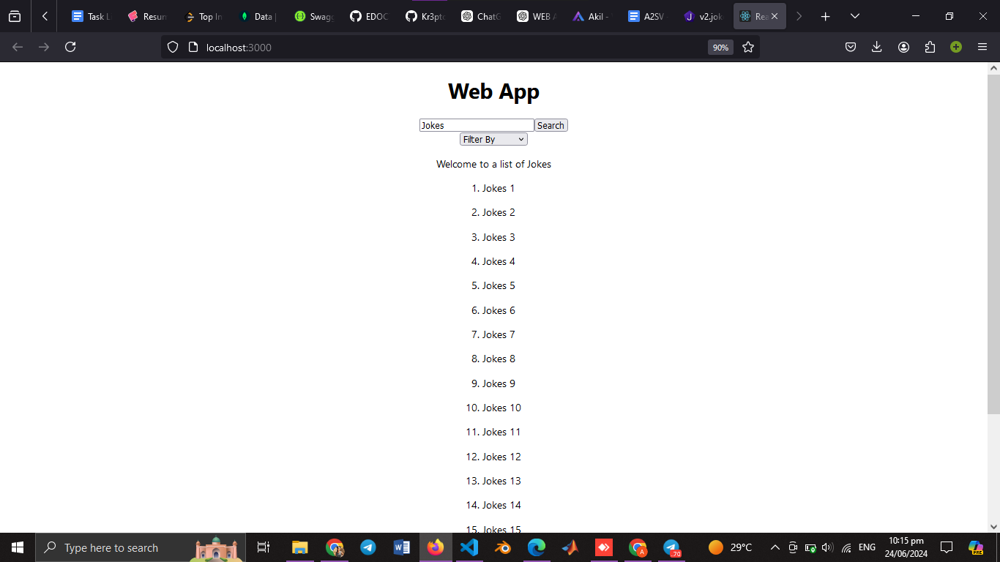

Name: Akua Serwaa Nkrumah
Email: ankrumah@a2sv.org

Screenshots:

Requirements

1. Using _React or Next_, build a web application that queries the provided endpoint.
2. Implement visually _appealing_ and _intuitive_, user interface.
   You can use a UI library (Ex. Material UI, TailwindCSS ...)
3. _Create a page that displays a list of jokes_, When no specific filter is selected, show a random set of 20 jokes.
4. _Implement a search functionality_ that enables users to search for jokes.
5. _Implement a Filtering functionality_ by category based on selected categories.
   Optional
6. Display _loading_ and _error_ states and other important status messages users may want to see.
7. Use either _Redux_ or _Redux Toolkit_ for state management. Save the fetched results in the store and render them appropriately.
